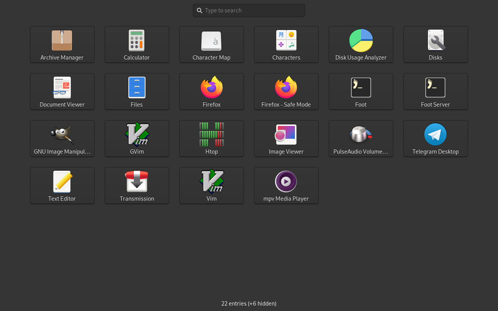

# wlaunchpad

Minimal mac-launchpad-alike, originally a fork of [nwg-drawer](https://github.com/nwg-piotr/nwg-drawer)

It's being developed with [sway](https://github.com/swaywm/sway) in mind, but
should also work with other wlroots-based Wayland compositors. X Window System
is not officially supported, but you should be able to use the drawer on some
floating window managers (tested on Openbox).

The `wlaunchpad` command displays the application grid.
The search entry allows to look for installed applications.

## Building

### Dependencies

- go >=1.16 (just to build)
- gtk3
- gtk-layer-shell
- xdg-utils

### Steps

1. Clone the repository, cd into it.
2. `sh build.sh`

Building the gotk3 library takes ages for the first time. If your machine is
glibc x86\_64, you can skip building and use released binary directly.
